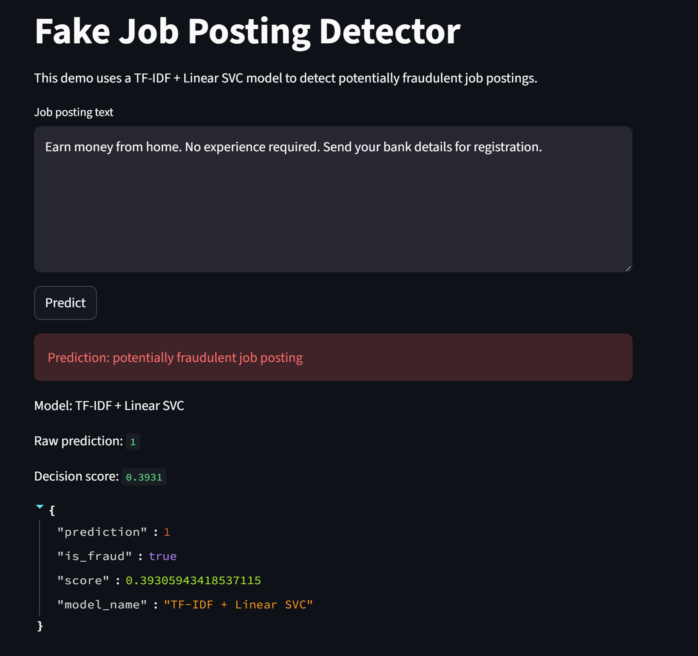
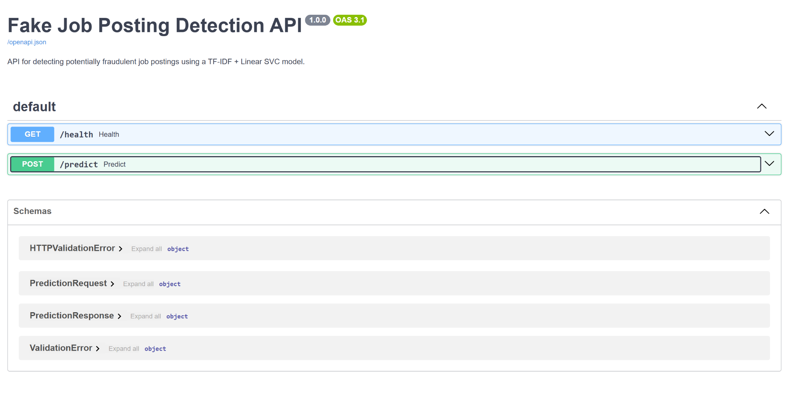
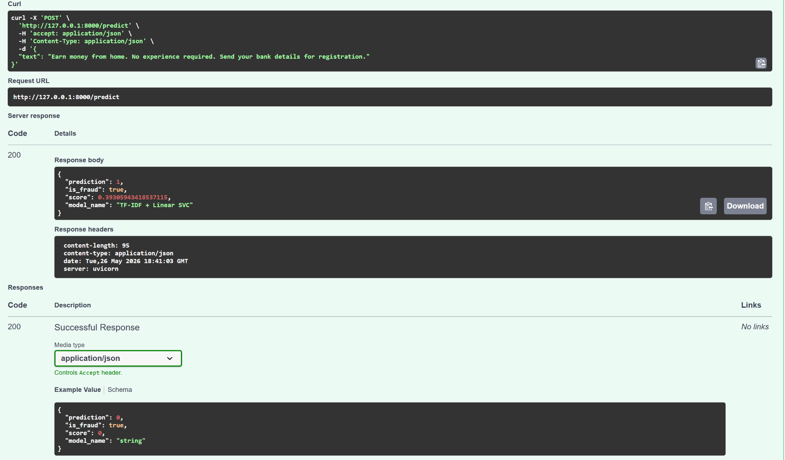
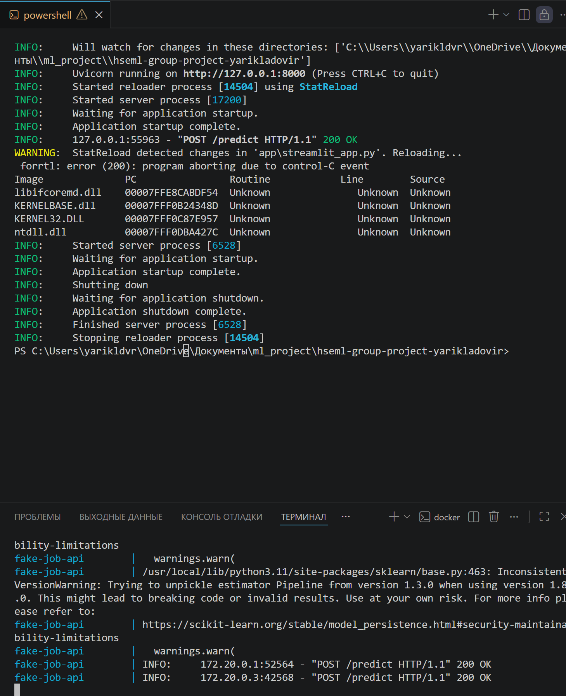

# Отчёт по проекту

**Студент:** Ладовир Ярослав Александрович  
**Группа:** БИВ238  

---

## 1. Введение и постановка задачи

- **Цель проекта:**  
  Цель проекта — построить модель машинного обучения, которая по тексту вакансии определяет, является ли вакансия реальной или мошеннической.

  Практическая ценность такой модели в том, что её можно использовать как фильтр для job board-платформ, HR-сервисов или пользователей, которые ищут работу. Мошеннические вакансии могут использоваться для сбора персональных данных, выманивания денег или публикации подозрительных предложений, поэтому важно автоматически находить такие объявления.

- **Формулировка задачи:**  
  Задача решается как бинарная классификация:

  - `0` — реальная вакансия;
  - `1` — мошенническая вакансия.

- **Обоснование метрики качества:**  
  В датасете есть сильный дисбаланс классов: мошеннических вакансий значительно меньше, чем реальных. Поэтому `accuracy` не подходит как основная метрика: модель может почти всегда предсказывать класс `0` и всё равно получать высокую accuracy.

  Основная метрика проекта — **F1-score для fraud-класса**.

  Она выбрана потому, что учитывает и precision, и recall:

  - `precision fraud` показывает, насколько часто вакансии, предсказанные как мошеннические, действительно являются мошенническими;
  - `recall fraud` показывает, какую долю настоящих мошеннических вакансий модель смогла найти.

  В этой задаче важно находить fraud-класс, но при этом не помечать слишком много реальных вакансий как мошеннические. Поэтому основной приоритет — F1-score для класса `1`.

---

## 2. Поиск и описание данных

- **Источник данных:**  
  В проекте используется датасет **Recruitment Scam / EMSCAD**.

  Источник: Kaggle  
  Ссылка: https://www.kaggle.com/datasets/amruthjithrajvr/recruitment-scam

  Я выбрал этот датасет, потому что он подходит под задачу бинарной классификации, содержит реальные текстовые описания вакансий и имеет понятную практическую ценность: определение мошеннических вакансий.

- **Описание датасета:**

  - Объём: **17 880 строк** и **18 столбцов**.
  - Целевая переменная: `fraudulent`.
  - Тип задачи: бинарная классификация.

  Основные признаки:

  - `title` — название вакансии;
  - `location` — локация;
  - `department` — отдел;
  - `salary_range` — зарплатная вилка;
  - `company_profile` — описание компании;
  - `description` — описание вакансии;
  - `requirements` — требования к кандидату;
  - `benefits` — бонусы и условия;
  - `telecommuting` — признак удалённой работы;
  - `has_company_logo` — наличие логотипа компании;
  - `has_questions` — наличие вопросов в анкете;
  - `employment_type` — тип занятости;
  - `required_experience` — требуемый опыт;
  - `required_education` — требуемое образование;
  - `industry` — индустрия;
  - `function` — функция/роль;
  - `fraudulent` — целевая переменная.

  В данных много текстовых признаков, поэтому основной подход в проекте — NLP-классификация на основе объединённого текста вакансии.

---

## 3. Обработка и подготовка данных

- **Полная очистка:**

  - **Пропуски:**  
    В текстовых колонках пропуски были заполнены пустой строкой, чтобы можно было объединить несколько текстовых полей в один общий текст. Для категориальных признаков пропуски анализировались отдельно, но в финальной NLP-модели основной фокус был сделан на тексте.

  - **Дубликаты:**  
    Дубликаты проверялись на этапе EDA. Их наличие важно учитывать, потому что одинаковые вакансии могут привести к завышению качества модели. После анализа данные были подготовлены к обучению так, чтобы не использовать явные повторяющиеся записи как источник утечки.

  - **Выбросы:**  
    Так как основная часть данных текстовая, классические числовые выбросы не были главным источником проблемы. Вместо этого анализировались длины текстов, наличие пустых описаний и распределение классов.

  - **Типы данных:**  
    Бинарные признаки и целевая переменная использовались как числовые значения. Текстовые признаки приводились к строковому типу перед объединением и очисткой.

- **Работа с фичами:**

  - Исходное количество признаков: 17 признаков + 1 целевая переменная.
  - Для финальной модели были использованы текстовые поля:

    - `title`;
    - `company_profile`;
    - `description`;
    - `requirements`;
    - `benefits`.

  Эти поля были объединены в новый признак `text`.

  Для текста была выполнена очистка:

  - удаление HTML-тегов;
  - удаление ссылок;
  - удаление лишних символов;
  - приведение к нижнему регистру;
  - удаление лишних пробелов;
  - заполнение пропусков пустой строкой.

  После этого текст преобразовывался в числовое представление с помощью `TfidfVectorizer`.

- **Визуализации:**  
  На этапе EDA были построены графики для анализа:

  - распределения целевой переменной;
  - дисбаланса классов;
  - пропусков в признаках;
  - распределения текстовых длин;
  - связей отдельных бинарных признаков с целевой переменной.

  Эти визуализации помогли понять, что задача несбалансированная, а основная информация для модели находится в текстовых описаниях вакансий.

- **Сплит данных:**

  Данные были разделены на train и test:

  - train — 80%;
  - test — 20%.

  Использовался `stratify=y`, чтобы сохранить долю мошеннических вакансий в train и test. Также был зафиксирован `random_state=42` для воспроизводимости экспериментов.

  Чтобы избежать data leakage, векторизация текста выполнялась внутри sklearn Pipeline: `TfidfVectorizer` обучался только на train-части, а затем применялся к test-части.

---

## 4. Baseline-модель

- **Модель:**  
  В качестве baseline использовалась простая модель:

  ```text
  TF-IDF + Logistic Regression
  ```

  Это стандартная и понятная базовая модель для текстовой классификации. Она была нужна как точка отсчёта для сравнения с более сложными моделями.

- **Результаты:**  

  | Модель | Precision fraud | Recall fraud | F1 fraud | ROC-AUC |
  |---|---:|---:|---:|---:|
  | Logistic Regression | 0.768 | 0.919 | 0.837 | 0.990 |

- **Цель:**  
  Baseline показал, что задача действительно решается по тексту: даже простая модель смогла находить fraud-вакансии. Однако precision был недостаточно высоким, поэтому дальше я сравнил несколько других моделей и подбирал гиперпараметры.

---

## 5. Эксперименты

Для экспериментов использовался общий пайплайн:

```text
объединённый текст вакансии → очистка текста → TF-IDF → классификатор
```

Основная метрика сравнения — `F1 fraud`.

### Таблица экспериментов

| Модель | Гипотеза | Параметры | Precision fraud | Recall fraud | F1 fraud | ROC-AUC | Комментарий |
|--------|----------|-----------|---:|---:|---:|---:|-------------|
| Logistic Regression | Линейная модель может хорошо работать на TF-IDF | базовые параметры | 0.768 | 0.919 | 0.837 | 0.990 | Хороший recall, но precision ниже |
| Linear SVC | SVM должен хорошо работать на разреженных TF-IDF-признаках | базовые параметры | 0.932 | 0.867 | 0.898 | 0.992 | Лучше baseline по F1 |
| Multinomial NB | Naive Bayes часто работает как простой baseline для текстов | базовые параметры | 0.828 | 0.277 | 0.416 | 0.944 | Слишком низкий recall |
| Complement NB | Может быть лучше Multinomial NB при дисбалансе | базовые параметры | 0.680 | 0.491 | 0.570 | 0.944 | Лучше NB, но хуже линейных моделей |
| SGDClassifier | Быстрая линейная модель для sparse-признаков | базовые параметры | 0.708 | 0.925 | 0.802 | 0.990 | Высокий recall, но низкий precision |
| Linear SVC char ngrams | Символьные n-граммы могут ловить шаблоны текста | char n-grams | 0.869 | 0.844 | 0.856 | 0.987 | Хуже word-level TF-IDF |
| Logistic Regression tuned | Подбор гиперпараметров улучшит baseline | GridSearchCV | 0.893 | 0.913 | 0.903 | 0.992 | Хороший результат, но хуже Linear SVC tuned |
| Linear SVC tuned | Подбор параметров TF-IDF и C улучшит SVC | GridSearchCV | 0.951 | 0.896 | 0.923 | 0.992 | Лучший результат |
| Linear SVC tuned + stopwords | Удаление stop words может убрать шум | stop_words="english" | 0.950 | 0.873 | 0.910 | 0.992 | Стало хуже, stop words не использовались |

### Эксперимент 1: сравнение базовых моделей

**Гипотеза:** разные классические модели для текстовой классификации дадут разное качество на TF-IDF-признаках.

**Как проверялось:** были обучены Logistic Regression, Linear SVC, Multinomial NB, Complement NB и SGDClassifier.

**Результат:** лучшие результаты среди базовых моделей показала Linear SVC. У Logistic Regression и SGDClassifier был хороший recall, но precision был ниже.

### Эксперимент 2: подбор гиперпараметров Linear SVC

**Гипотеза:** настройка TF-IDF и параметра регуляризации `C` улучшит качество Linear SVC.

**Как проверялось:** использовался GridSearchCV. Подбирались параметры:

- `max_features`;
- `ngram_range`;
- `min_df`;
- `C`;
- `class_weight`.

**Результат:** лучшая модель получила:

- `Precision fraud = 0.951`;
- `Recall fraud = 0.896`;
- `F1 fraud = 0.923`;
- `ROC-AUC = 0.992`.

Это лучший результат среди всех экспериментов.

### Эксперимент 3: Logistic Regression tuned

**Гипотеза:** Logistic Regression после подбора гиперпараметров может улучшить baseline.

**Как проверялось:** подбирались параметры TF-IDF и регуляризации.

**Результат:** качество выросло до `F1 fraud = 0.903`, но это всё равно хуже, чем у tuned Linear SVC.

### Эксперимент 4: stop words

**Гипотеза:** удаление английских stop words может убрать шум и улучшить качество.

**Как проверялось:** была обучена версия tuned Linear SVC с `stop_words="english"`.

**Результат:** качество снизилось с `F1 fraud = 0.923` до `0.910`. Значит, часть stop words могла быть полезна для контекста вакансии, поэтому в финальной модели они не удалялись.

### Эксперимент 5: character n-grams

**Гипотеза:** character n-grams могут помочь находить характерные шаблоны в мошеннических вакансиях.

**Как проверялось:** была обучена Linear SVC на символьных n-граммах.

**Результат:** `F1 fraud = 0.856`, что хуже word-level TF-IDF. Поэтому этот вариант не выбран.

### Уменьшение размерности

В проекте использовалось большое количество TF-IDF-признаков. Отдельное PCA для финальной модели не применялось, потому что TF-IDF создаёт разреженную матрицу, а PCA плохо подходит для таких данных по памяти и скорости.

Вместо этого размерность контролировалась параметрами `TfidfVectorizer`:

- `max_features`;
- `min_df`;
- `ngram_range`.

В финальной модели использовалось ограничение `max_features=50000`, что позволило сохранить информативные слова и биграммы, но не раздувать пространство признаков бесконтрольно.

---

## 6. Финальная модель и интерпретируемость

- **Обоснование выбора финальной модели:**  

  Финальная модель:

  ```text
  TF-IDF + Linear SVC
  ```

  Она выбрана, потому что показала лучший F1-score для fraud-класса среди всех экспериментов.

  Финальные метрики:

  | Метрика | Значение |
  |---|---:|
  | Accuracy | 0.993 |
  | Precision fraud | 0.951 |
  | Recall fraud | 0.896 |
  | F1 fraud | 0.923 |
  | ROC-AUC | 0.992 |

  Эта модель хорошо балансирует precision и recall. Она находит большую часть мошеннических вакансий и при этом не создаёт слишком много ложных срабатываний.

- **Интерпретируемость:**  

  Модель Linear SVC является линейной, поэтому её можно интерпретировать через веса признаков.

  После TF-IDF каждый признак соответствует слову или биграмме. Если коэффициент признака положительный, он сдвигает предсказание в сторону fraud-класса. Если коэффициент отрицательный, он сдвигает предсказание в сторону реальной вакансии.

  Это делает модель более интерпретируемой, чем полностью чёрный ящик: можно смотреть, какие слова и фразы сильнее всего влияют на классификацию.

  Также был проведён анализ ошибок. Финальная модель ошиблась на части объектов:

  - false positive — реальные вакансии, которые модель ошибочно пометила как мошеннические;
  - false negative — мошеннические вакансии, которые модель не нашла.

  Для этой задачи false negative особенно важны, потому что это мошеннические вакансии, которые могут остаться на платформе. Поэтому при выборе модели я ориентировался на F1 fraud, а не только на accuracy.

---

## 7. Деплой

- **Интерфейс:**  

  Для демонстрации модели был реализован Streamlit-интерфейс:

  ```text
  app/streamlit_app.py
  ```

  Пользователь может вставить текст вакансии и нажать кнопку `Predict`. После этого приложение отправляет запрос в API и показывает результат модели.

  Скриншот интерфейса:

  

- **API:**  

  Для инференса модели был реализован FastAPI-сервис:

  ```text
  src/api.py
  ```

  Основные endpoints:

  - `GET /health` — проверка состояния сервиса;
  - `POST /predict` — получение предсказания по тексту вакансии.

  Пример запроса:

  ```json
  {
    "text": "Earn money from home. No experience required. Send your bank details for registration."
  }
  ```

  Пример ответа:

  ```json
  {
    "prediction": 1,
    "is_fraud": true,
    "score": 0.4745,
    "model_name": "TF-IDF + Linear SVC"
  }
  ```

- **Скриншоты работы интерфейса/API:**  

  Swagger-документация API:

  

  Успешный ответ endpoint `/predict`:

  

  Запуск через Docker Compose:

  

- **Ссылка на видео демонстрации работы:**  

  [Видео демонстрации](https://drive.google.com/file/d/1lluITN4rVGJZtttX-YgeP3bVAebzF5yU/view?usp=sharing)

  Для воспроизводимого запуска были добавлены:

  ```text
  Dockerfile
  docker-compose.yml
  ```

  Команда запуска:

  ```bash
  docker compose up --build
  ```

  После запуска доступны:

  ```text
  http://127.0.0.1:8000/docs
  http://localhost:8501
  ```

---

## 8. Заключение и выводы

- **Итоги:**  

  В проекте была решена задача бинарной классификации вакансий на реальные и мошеннические.

  Было сделано:

  - изучен и подготовлен датасет Recruitment Scam / EMSCAD;
  - проведена очистка текстовых данных;
  - создан общий текстовый признак;
  - построен baseline на TF-IDF + Logistic Regression;
  - проведены эксперименты с несколькими моделями;
  - подобраны гиперпараметры для лучших моделей;
  - выбрана финальная модель TF-IDF + Linear SVC;
  - модель сохранена в `.joblib`;
  - реализованы FastAPI API, Streamlit-интерфейс и Docker Compose;
  - подготовлены скриншоты и видео работы.

  По сравнению с baseline итоговая модель улучшила F1 fraud:

  - baseline Logistic Regression: `F1 fraud = 0.837`;
  - финальная Linear SVC tuned: `F1 fraud = 0.923`.

- **Ограничения:**  

  У проекта есть несколько ограничений:

  - датасет несбалансирован, fraud-класса мало;
  - модель обучена на конкретном датасете и может хуже работать на вакансиях из других источников;
  - используется классический TF-IDF-подход, который не всегда понимает глубокий смысл текста;
  - деплой реализован локально, без публикации на внешнем сервере.

- **Возможные улучшения:**  

  Возможные направления дальнейшей работы:

  - собрать более свежие данные с job board-платформ;
  - добавить больше признаков о компании, зарплате и локации;
  - попробовать transformer-модели, например BERT/RoBERTa;
  - настроить порог принятия решения в зависимости от желаемого баланса precision/recall;
  - добавить логирование запросов в API;
  - задеплоить сервис на внешний сервер или облачную платформу.